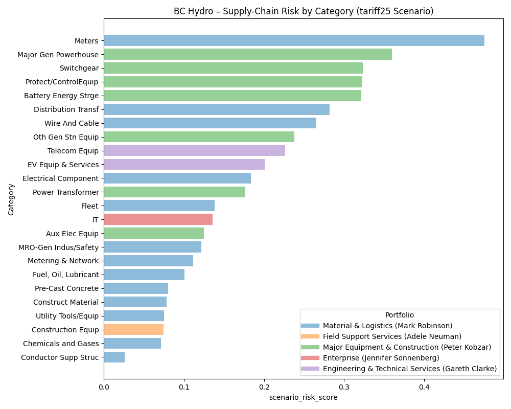

# bc_hydro_hackathon

## 1. Install 

### 1.1. macO
```sh
python3 -m venv .bc_hydro_env
source .bc_hydro_env/bin/activate
pip install -r requirements.txt
```

### 1.2. Windows

```sh
python -m venv .bc_hydro_env
.bc_hydro_env\Scripts\activate
pip install -r requirements.txt
```

## 2. Run Simulation

```sh
python main.py --out risk_scores_base.csv
```

```sh
python main.py --scenario us_tariff_25pct --out risk_scores_tariff25.csv
```

```sh
python main.py --scenario us_tariff_50pct --out risk_scores_tariff50.csv
```

## 3. Results


