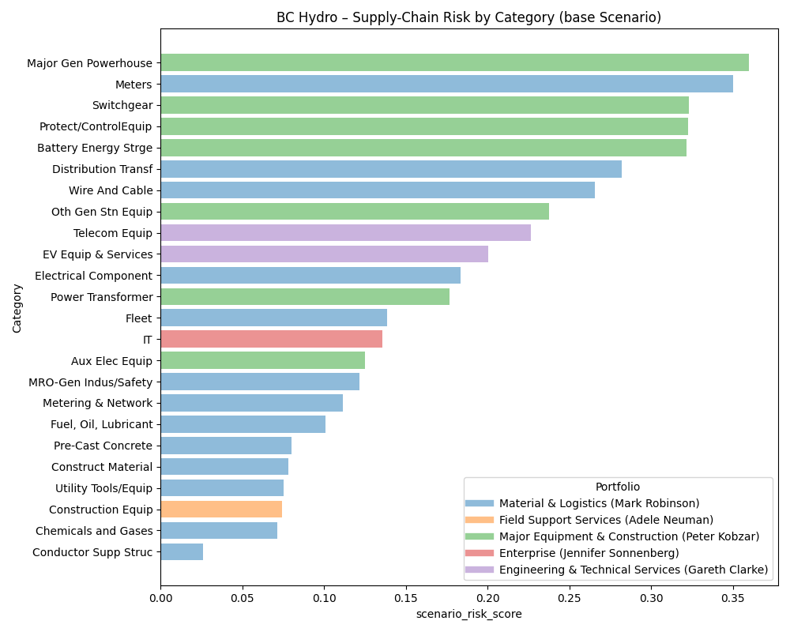

# bc_hydro_hackathon

## Logic


#### **Scale Inputs (min–max or z-score)**

For each driver $x$:

* **Min–max (default):**

$$
s_{c,x} = \frac{x_c - \min_k(x_k)}{\max_k(x_k) - \min_k(x_k)}
$$
* **Z-score (optional):**

$$
s_{c,x} = \frac{x_c - \mu_x}{\sigma_x}
$$

#### **2. Internal Risk Score**

$$
I_c = 0.40\,s_{c,\text{LT}} + 0.20\,s_{c,\text{CV}} + 0.20\,s_{c,\text{VC}} + 0.20\,s_{c,\text{DOS}}
$$

#### **3. External Risk Score**

$$
s_{c,\text{LOG}} = 1 - s_{c,\text{LPI}}
$$

$$
E_c = 0.50\,s_{c,\text{LOG}} + 0.30\,d_{c,\text{US}}
$$

#### **4. Base Risk Score**

$$
R^{\text{base}}_c = \frac{1}{2}(I_c + E_c)
$$

#### **5. Adjusted for Risk Tolerance**

$$
R^{\text{adj}}_c = R^{\text{base}}_c \times m_c
\quad
\begin{cases}
1.00 & \text{High} \\
0.85 & \text{Medium} \\
0.70 & \text{Low}
\end{cases}
$$

#### **6. Tariff-Shock Scenario**

If U.S. dependency $d_{c,\text{US}} > 0.50$:

$$
R^{\text{tariff}} = R^{\text{adj}} + d_{c,\text{US}} \cdot 0.25
$$


## 1. Install 

### 1.1. macOS
```sh
python3 -m venv .bc_hydro_env
source .bc_hydro_env/bin/activate
pip install -r requirements.txt
```

### 1.2. Windows

```sh
python -m venv .bc_hydro_env
.bc_hydro_env\Scripts\activate
pip install -r requirements.txt
```

## 2. Run Simulation

```sh
python main.py --out risk_scores_base.csv
```

```sh
python main.py --scenario us_tariff_25pct --out risk_scores_tariff25.csv
```

```sh
python main.py --scenario us_tariff_50pct --out risk_scores_tariff50.csv
```

## 3. Results



